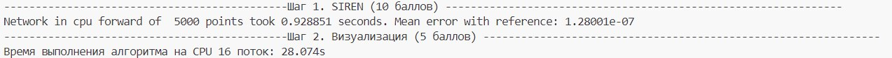
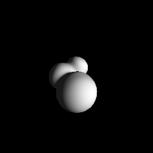
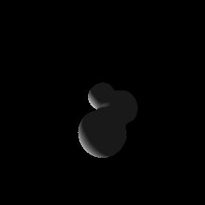
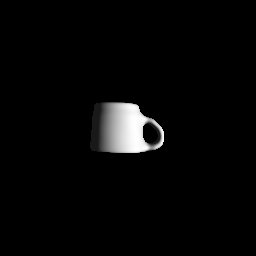
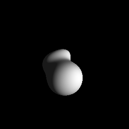
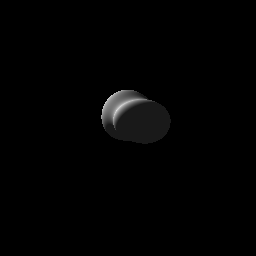

# Выполненные задачи 
## Шаг 1. SIREN (10 баллов)
## Шаг 2. Визуализация (5 баллов) 


sdf1_arch use pretrained weights, cam1 


sdf1_arch use pretrained weights, cam2


sdf2_arch use pretrained weights, cam1


## Шаг 3. Обучение (10 баллов) (CPU)
CPU Train 10 epochs took 95.83 seconds. LOSS: from 0.3 -> 0.09
sdf1_arch, From zero trained on cpu , cam1 ,took about 1 hours,loss ~= 2e-4





## Шаг 4. Перенос прямого прохода на GPU (5 баллов)

не сделал....

## Шаг 5. Перенос обратного прохода на GPU (10 баллов)
USE CUDA 11.2
GPU my train, took about 30 mins, loss = 2e-4


```
network_init.to_gpu();
train_gpu(network_init,train_dataloader,epoches);
````
### CPU VS GPU training 
#### UPDATE:
In good computer:

CPU Train 151 epochs took 99.5315 seconds.
GPU Train 151 epochs took 19.6374 seconds.
GPU FASTER!!!!!!!!!!!!!!

The following results are run on a wsl2 virtual machine of gtx 1060, and the speed of running on a gpu is not very fast.

#### FOR sdf1_arch.txt 
CPU Train 10 epochs took 95.83 seconds. LOSS: from 0.3 -> 0.09

GPU Train 10 epochs took 34.0599 seconds. When block size = 8
LOSS: from 0.3 -> 0.09 

GPU Train 10 epochs took 68.2487 seconds. When block size = 4 

GPU Train 10 epochs took 41.5208 seconds. When block size =12

GPU Train 10 epochs took 41.5521 seconds.When block size = 16
#### FOR sdf2_arch.txt
 loss : 0.0321707 step :  96 epoch : 0 lr : 0.0005
CPU Train 1epochs took 346.192 seconds.

GPU TRAIN: LOSS: 0.0182058 step :  96 epoch : 0 lr : 0.0005
GPU Train 1 epochs took 183.098 seconds.

# run code 
```
rm -r build
mkdir build
cd build
cmake ..
make 
./neural_sdf \
../data/sdf1_test.bin \
../data/sdf1_arch.txt \
../data/sdf1_weights.bin \
../data/cam1.txt \
../data/light.txt \
../data/sdf1_test.bin
```

